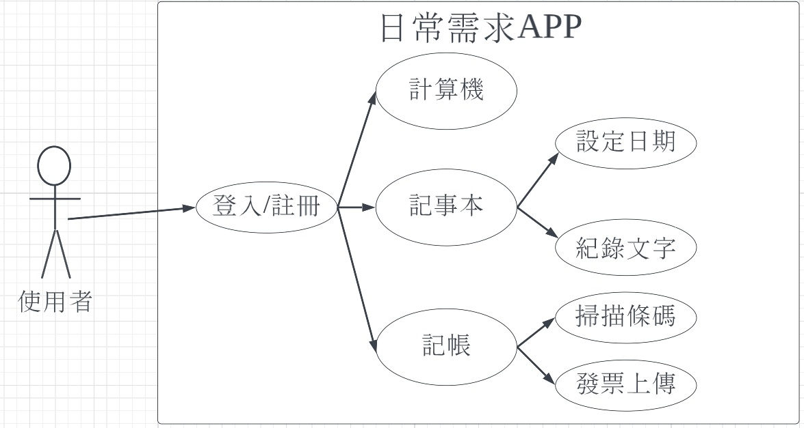

# 功能性需求
| 功能性需求      | 
| :------------- | 
| 計算機         | 
| 記事本       | 
| 記帳          | 

# 非功能性需求
| 非功能性需求      |  說明                        | 
| :------------- |:----------------------------- |
| 使用性         | 使用者看到3秒內能反映出來怎麼使用|
| 反應時間       | 使用者按下介面的圖形後，APP能在1秒內做出反應|
| 正確率         | 在日常使用時Bug出現率0.1% |

***
#  功能分解圖

***
# 需求分析文字描述    
(1)**記事本**:使用者可以在這裡記錄重要的事項   
(2)**記帳功能**:使用者可以記錄每天的收入及支出，達到有效的金錢控管  
(3)**計算機**使用者可以使用簡單易懂的介面，做出基本的運算   
***
# 使用案例圖

***
| **使用案例名稱**|**使用者開啟計算機**| 
| :------------- |:------------------|
| 行動者         | 使用者             |
| 說明           | 使用者使用計算機的過程|
| 完成動作       | 1.使用者開啟計算機  |
|               | 2.使用者執行運算功能 |
| 先決條件       |下載APP             |
|後置條件        | 無                 |
|假設           |  無                 |
***
| **使用案例名稱**|**使用者開啟記事本**| 
| :------------- |:------------------|
| 行動者         | 使用者             |
| 說明           | 使用者使用記事本的過程|
| 完成動作       | 1.使用者紀錄日期    |
|               | 2.使用者輸入文字，紀錄重要事項|
| 先決條件       |下載APP             |
|後置條件       |     無              |
|假設           |    無              |
***
| **使用案例名稱**|**使用者開啟記帳簿**| 
| :------------- |:------------------|
| 行動者         | 使用者             |
| 說明           | 使用者使用記事本的過程|
| 完成動作       | 1.使用者開啟條碼掃描器，掃描發票  |
|               | 2.使用者輸入文字，紀錄該日消費金額|
| 先決條件       |下載APP             |
|後置條件       |     無              |
|假設           |    無               |
***
**Figma**
[使用案例動態模擬](https://www.figma.com/file/7OuAExkDQspSDHSAt2nI7w/Untitled?node-id=2%3A166)

