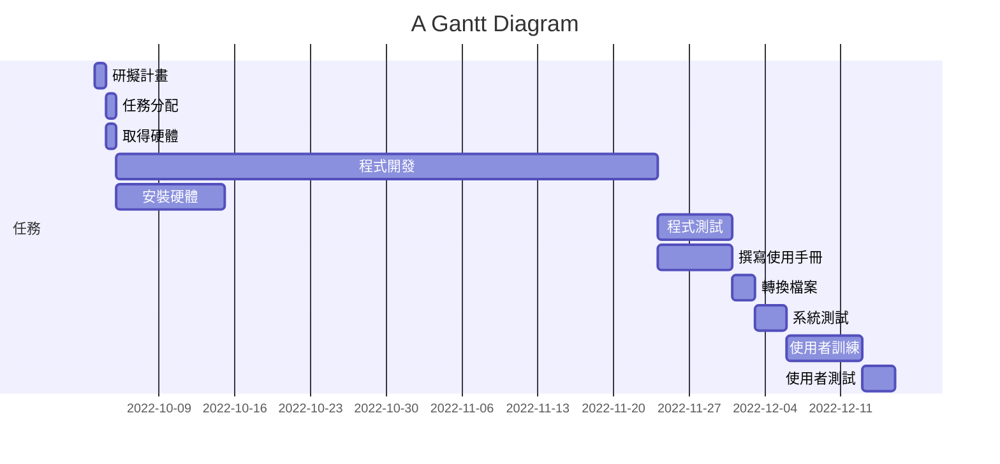
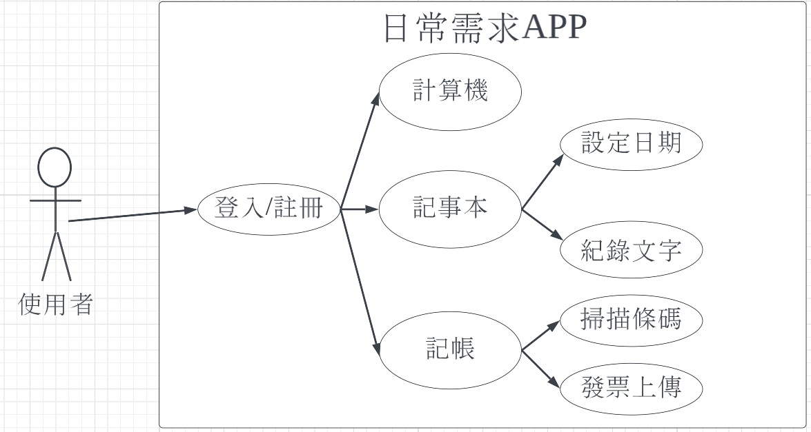

# 第二組  日常需求APP   
***
| 職稱          | 組員             | 工作內容    |
| :----------- | :---------------:| :---------- |
| 組長         | C109118157_吳曄聰 | 掌控小組進度 |
| 組員         | C109118133_張哲豪 | 程式開發    |
| 組員         | C109118136_吳柏憲 | 程式開發    |
| 組員         | C109118147_黃梃祥 | 程式開發    |
| 組員         | C109118156_邱健誠 | 程式開發    |
***

***

***
| 功能性需求      | 
| :------------- | 
| 計算機         | 
| 記事本       | 
| 記帳          | 
***
| 非功能性需求      |  說明                        | 
| :------------- |:----------------------------- |
| 使用性         | 使用者看到3秒內能反映出來怎麼使用|
| 反應時間       | 使用者按下介面的圖形後，APP能在1秒內做出反應|
| 正確率         | 在日常使用時Bug出現率0.1% |

***
**功能分解圖**

***
**需求分析文字描述**   
(1)**登入功能**:使用者可以登入及註冊帳號   
(2)**記事本**:使用者可以在這裡記錄重要的事項   
(3)**記帳功能**:使用者可以記錄每天的收入及支出，達到有效的金錢控管  
(4)**計算機**使用者可以使用簡單易懂的介面，做出基本的運算   
***

***
| **使用案例名稱**|**使用者登入/註冊帳號**| 
| :------------- |:------------------|
| 行動者         | 使用者             |
| 說明           | 使用者登入或註冊帳號|
| 完成動作       | 1.使用者輸入帳號密碼後登入系統  |
|               | 2.使用者輸入個人資料註冊帳號|
| 先決條件       | 無       |
|後置條件        |                     |
|假設           |使用者若沒有註冊過帳號，會被帶到註冊頁面進行註冊|
***
| **使用案例名稱**|**使用者開啟計算機**| 
| :------------- |:------------------|
| 行動者         | 使用者             |
| 說明           | 使用者使用計算機的過程|
| 完成動作       | 1.使用者開啟計算機  |
|               | 2.使用者執行運算功能|
| 先決條件       |使用者登入帳號       |
|後置條件        |                     |
|假設           |  無                   |
***
| **使用案例名稱**|**使用者開啟記事本**| 
| :------------- |:------------------|
| 行動者         | 使用者             |
| 說明           | 使用者使用記事本的過程|
| 完成動作       | 1.使用者紀錄日期  |
|               | 2.使用者輸入文字，紀錄重要事項|
| 先決條件       |使用者登入帳號      |
|後置條件       |                    |
|假設           |    無              |
***
| **使用案例名稱**|**使用者開啟記事本**| 
| :------------- |:------------------|
| 行動者         | 使用者             |
| 說明           | 使用者使用記事本的過程|
| 完成動作       | 1.使用者開啟條碼掃描器，掃描發票  |
|               | 2.使用者輸入文字，紀錄該日消費金額|
| 先決條件       |使用者登入帳號       |
|後置條件       |                     |
|假設           |    無               |
***
**Figma**
[使用案例動態模擬](https://www.figma.com/file/7OuAExkDQspSDHSAt2nI7w/Untitled?node-id=2%3A166)

