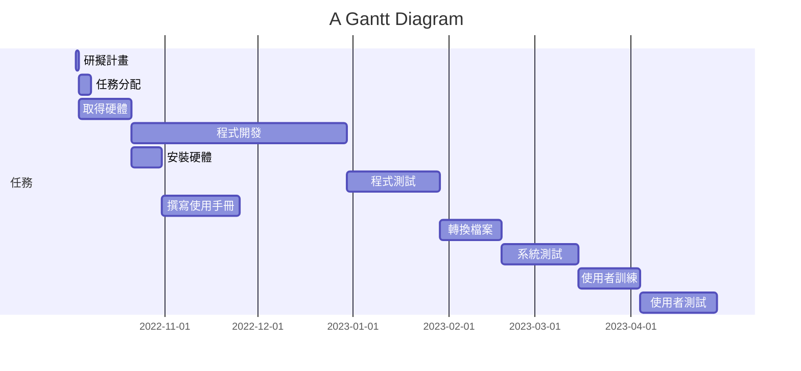

# 第二組  AndroidApp開發
***
| 職稱          | 組員             | 工作內容    |
| :----------- | :---------------:| :---------- |
| 組長         | C109118157_吳曄聰 | 掌控小組進度 |
| 組員         | C109118133_張哲豪 | 程式開發    |
| 組員         | C109118136_吳柏憲 | 程式開發    |
| 組員         | C109118147_黃梃祥 | 程式開發    |
| 組員         | C109118156_邱健誠 | 程式開發    |
***
***

***

