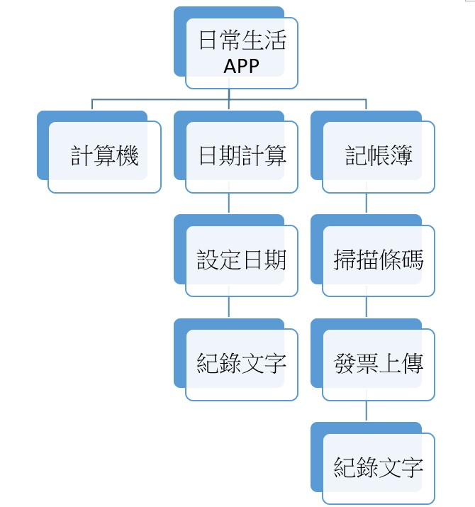

# 第二組  開發
***
| 職稱          | 組員             | 工作內容    |
| :----------- | :---------------:| :---------- |
| 組長         | C109118157_吳曄聰 | 掌控小組進度 |
| 組員         | C109118133_張哲豪 | 程式開發    |
| 組員         | C109118136_吳柏憲 | 程式開發    |
| 組員         | C109118147_黃梃祥 | 程式開發    |
| 組員         | C109118156_邱健誠 | 程式開發    |
***

***

***
| 功能性需求      | 
| :------------- | 
| 計算機         | 
| 記事本       | 
| 記帳          | 
***
| 非功能性需求      |  說明                        | 
| :------------- |:----------------------------- |
| 使用性         | 使用者看到3秒內能反映出來怎麼使用|
| 反應時間       | 程式能在非正常干擾下立即完整執行|
| 可靠度          | 在日常使用時Bug出現率0.1% |

***
**功能分解圖**

***
**需求分析文字描述**   
(1)**登入功能**:使用者可以登入及註冊帳號   
(2)**記事本**:使用者可以在這裡記錄重要的事項   
(3)**記帳功能**:使用者可以記錄每天的收入及支出，達到有效的金錢控管  
(4)**計算機**使用者可以使用簡單易懂的介面，做出基本的運算   

